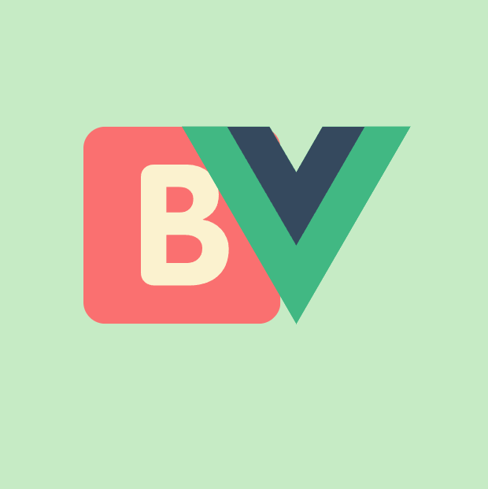

[![Contributors][contributors-shield]][contributors-url]
[![Forks][forks-shield]][forks-url]
[![Stargazers][stars-shield]][stars-url]
[![Issues][issues-shield]][issues-url]
[![LinkedIn][linkedin-shield]][linkedin-url]

<!-- PROJECT LOGO -->
<br />
<div align="center">
  <a href="https://github.com/kostastepetes/boilervue-atomic-design-system">
    
  </a>

  <h3 align="center">BoilerVue</h3>

  <p align="center">
    🟢 BoilerVue is an Atomic Design System for Vue.js
    <br />
    <a href="https://github.com/kostastepetes/boilervue-atomic-design-system"><strong>Explore the docs »</strong></a>
    <br />
    <br />
    <a href="https://github.com/kostastepetes/boilervue-atomic-design-system/blob/main/homepage.html">View Demo</a>
    ·
    <a href="https://github.com/kostastepetes/boilervue-atomic-design-system/issues">Report Bug</a>
    ·
    <a href="https://github.com/kostastepetes/boilervue-atomic-design-system/issues">Request Feature</a>
  </p>
</div>


<!-- TABLE OF CONTENTS -->
<details>
  <summary>Table of Contents</summary>
  <ol>
    <li>
      <a href="#about-the-project">About The Project</a>
      <ul>
        <li><a href="#built-with">Built With</a></li>
      </ul>
    </li>
    <li>
      <a href="#getting-started">Getting Started</a>
      <ul>
        <li><a href="#prerequisites">Prerequisites</a></li>
        <li><a href="#installation">Installation</a></li>
      </ul>
    </li>
    <li><a href="#usage">Usage</a></li>
    <li><a href="#roadmap">Roadmap</a></li>
    <li><a href="#contributing">Contributing</a></li>
    <li><a href="#contact">Contact</a></li>
  </ol>
</details>


<!-- ABOUT THE PROJECT -->
## About The Project

BoilerVue is an Atomic Design System for Vue.js. It's an Open Source Project so if you are a frontend developer...feel free to contribute

### What is Atomic Design?
Atomic design is methodology for creating design systems. There are five distinct levels in atomic design:
1. Atoms: Atoms are the basic building blocks of matter. Applied to web interfaces, atoms are our HTML tags, such as a form label, an input or a button.
2. Molecules: Molecules are groups of atoms bonded together and are the smallest fundamental units of a compound.
3. Organisms: Organisms are groups of molecules joined together to form a relatively complex, distinct section of an interface.
4. Templates: Templates consist mostly of groups of organisms stitched together to form pages.
5. Pages: Pages are specific instances of templates. Here, placeholder content is replaced with real representative content to give an accurate depiction of what a user will ultimately see.

Atomic Design: 

[![Product Name Screen Shot][product-screenshot]](https://github.com/kostastepetes/boilervue-atomic-design-system/blob/main/public/atomic-design-process.png)


### Built With


* [![Vue][Vue]][Vue-url]

<p align="right">(<a href="#readme-top">back to top</a>)</p>


<!-- GETTING STARTED -->
## Getting Started

### Prerequisites


* npm
  ```sh
  npm install npm@latest -g
  ```
  
  * vue.js
  ```sh
  npm init vue@latest
  ```
  

### Installation

1. Clone the repo
   ```sh
   git clone https://github.com/kostastepetes/boilervue-atomic-design-system.git
   ```
2. Install NPM packages
   ```sh
   npm install
   ```

<p align="right">(<a href="#readme-top">back to top</a>)</p>


<!-- USAGE EXAMPLES -->
## Usage

_For more examples, please refer to the [Documentation](https://github.com/kostastepetes/boilervue-atomic-design-system)_

<p align="right">(<a href="#readme-top">back to top</a>)</p>


<!-- ROADMAP -->
## Roadmap

- [x] Add README
- [ ] Add More Components
- [ ] Add Additional Examples


See the [open issues](https://github.com/kostastepetes/boilervue-atomic-design-system/issues) for a full list of proposed features (and known issues).

<p align="right">(<a href="#readme-top">back to top</a>)</p>


<!-- CONTRIBUTING -->
## Contributing

Contributions are what make the open source community such an amazing place to learn, inspire, and create. Any contributions you make are **greatly appreciated**.

1. Fork the Project
2. Create your Feature Branch (`git checkout -b feature/AmazingFeature`)
3. Commit your Changes (`git commit -m 'Add some AmazingFeature'`)
4. Push to the Branch (`git push origin feature/AmazingFeature`)
5. Open a Pull Request

<p align="right">(<a href="#readme-top">back to top</a>)</p>


<!-- CONTACT -->
## Contact

LinkedIn - [@kostastepetes](https://www.linkedin.com/in/kostas-tepetes) 

Project Link: [https://github.com/kostastepetes/boilervue-atomic-design-system](https://github.com/kostastepetes/boilervue-atomic-design-system)

<p align="right">(<a href="#readme-top">back to top</a>)</p>


<!-- MARKDOWN LINKS & IMAGES -->
<!-- https://www.markdownguide.org/basic-syntax/#reference-style-links -->
[contributors-shield]: https://img.shields.io/github/contributors/kostastepetes/boilervue-atomic-design-system.svg?style=for-the-badge
[contributors-url]: https://github.com/kostastepetes/boilervue-atomic-design-system/graphs/contributors
[forks-shield]: https://img.shields.io/github/forks/kostastepetes/boilervue-atomic-design-system.svg?style=for-the-badge
[forks-url]: https://github.com/kostastepetes/boilervue-atomic-design-system/network/members
[stars-shield]: https://img.shields.io/github/stars/kostastepetes/boilervue-atomic-design-system.svg?style=for-the-badge
[stars-url]: https://github.com/kostastepetes/boilervue-atomic-design-system/stargazers
[issues-shield]: https://img.shields.io/github/issues/kostastepetes/boilervue-atomic-design-system.svg?style=for-the-badge
[issues-url]: https://github.com/kostastepetes/boilervue-atomic-design-system/issues
[linkedin-shield]: https://img.shields.io/badge/-LinkedIn-black.svg?style=for-the-badge&logo=linkedin&colorB=555
[linkedin-url]: https://www.linkedin.com/in/kostas-tepetes
[product-screenshot]: public/atomic-design-process.png
[Vue]: https://img.shields.io/badge/-Vue.js-4fc08d?style=flat&logo=vuedotjs&logoColor=white
[Vue-url]: https://vuejs.org/
